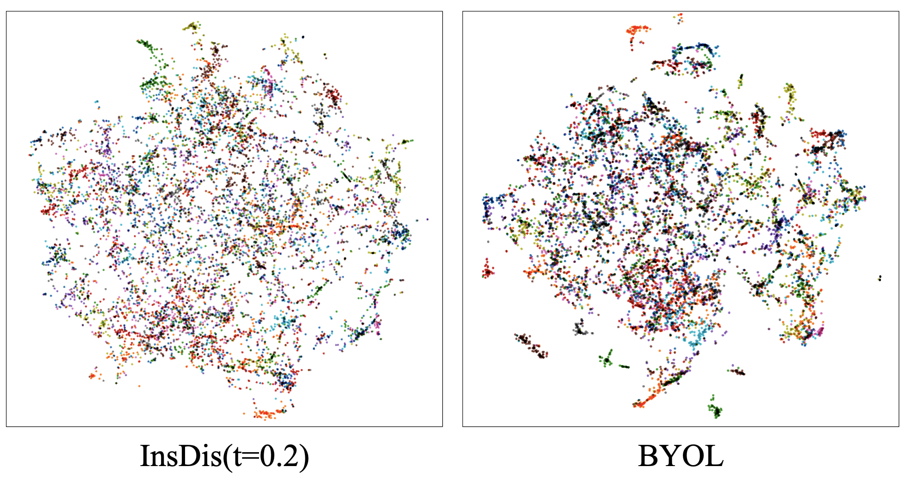

### Implementation of Contrastive Learning Methods based on Memory Bank and BYOL
Run the Instance Discrimination (representative contrastive learning method) task by:
 
`python run.py --data './data/' --cudaenv '0,1,2,3' --gpus '0,1,2,3' --exp 'your_exp_path' --dataset cifar100 --batch_size 128 --lr 0.03 --network resnet18_cifar --t 0.30 --loss insd`

Run the BYOL by the following command:
 
`python byol.py --data './data/' --cudaenv '0,1,2,3' --gpus '0,1,2,3' --exp 'your_exp_path' --dataset cifar100 --batch_size 512 --lr 0.12 --network resnet18_cifar`

### CIFAR100 Results (with ResNet-18 as Default Backbone)
For Instance Discrimination task, the results on CIFAR100 with different temperatures (weight decay of 5e-4, linear projection head) are:

--------

Temporature  | 0.05 | 0.07 | 0.10|0.20|0.30|0.40|0.50|0.60|0.70|0.80|
--------- | --------| --- | --- | --- | --- | --- | --- | --- | --- | --- |
LinearAcc |49.80|51.82|52.46|56.05|**56.44**|55.47|54.17|53.05|50.99|50.08|

-------
the best temperature is 0.3. When replacing a mlp projection head (with batch normalization), the accuracy is 56.48 (batch size of 512 lr 0.12), giving neglectable improvement on small scale dataset.

For BYOL, I have only tested a simple set of hyper-parameters: using a fixed momentum of m=0.996 (instead of a cosine ramp up function in the original paper):

|Network|BYOL|BestInsDis|
|----|----|----|
|Res18|59.96|56.44|
|Res50|64.64|62.74|

#### BYOL Loss Curve
-----------------------------

<!--  -->

-----------------------------

#### Embedding Visualization

The T-SNE visualization of features from fc layer.

----------------------

