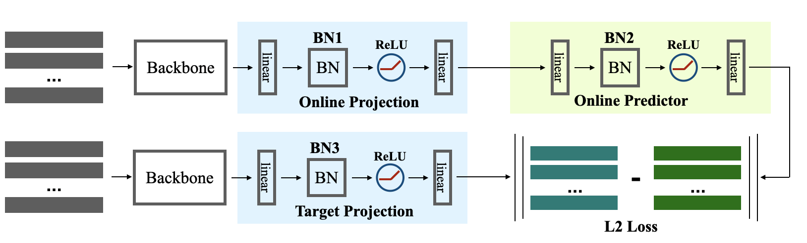

### Implementation of Contrastive Learning Methods based on Memory Bank, SimCLR and BYOL
Run the Instance Discrimination (representative contrastive learning method) task by:
 
`python run.py --data './data/' --cudaenv '0,1,2,3' --gpus '0,1,2,3' --exp 'your_exp_path' --dataset cifar100 --batch_size 128 --lr 0.03 --network resnet18_cifar --t 0.30 --loss insd`

Run SimCLR by the following command:

`python simclr.py --data './data/' --cudaenv '0,1,2,3' --gpus '0,1,2,3' --exp 'your_exp_path' --dataset 'cifar100' --batch_size 1024 --lr 0.3 --network 'resnet18_cifar' --blur --mlpbn 1 --t 0.50`

Run the BYOL by the following command:
 
`python byol.py --data './data/' --cudaenv '0,1,2,3' --gpus '0,1,2,3' --exp 'your_exp_path' --dataset cifar100 --batch_size 512 --lr 0.12 --network resnet18_cifar`

### CIFAR100 Results (with ResNet-18 as Default Backbone)
For Instance Discrimination task, the results on CIFAR100 with different temperatures (weight decay of 5e-4, linear projection head) are:

--------

Temporature  | 0.05 | 0.07 | 0.10|0.20|0.30|0.40|0.50|0.60|0.70|0.80|
--------- | --------| --- | --- | --- | --- | --- | --- | --- | --- | --- |
LinearAcc |49.80|51.82|52.46|56.05|**56.44**|55.47|54.17|53.05|50.99|50.08|

-------
the best temperature is 0.3. When replacing a mlp projection head (with batch normalization), the accuracy is 56.48 (batch size of 512 lr 0.12), giving neglectable improvement on small scale dataset.

For BYOL, I have only tested a simple set of hyper-parameters: using a fixed momentum of m=0.996 (instead of a cosine ramp up function in the original paper):

|Network|BYOL|BYOL(aug+)|SimCLR(t=0.5,aug+)|BestInsDis|
|----|----|----|----|----|
|Res18|59.96|62.74|60.78|56.44|
|Res50|64.64|65.51|--|62.74|

CIFAR100 is not very stable, linear results with seven tries with same hyper-parameters (with blur):
63.37, 62,82, 63.53, 63.32, 63.14, 63.53, 63.75   

#### BYOL Loss Curve
-----------------------------

<!--  -->
Loss Curve on ResNet-18 BYOL (left) and ResNet-50 BYOL (right)

-----------------------------

#### Embedding Visualization

##### ResNet18 FC Comparison.
The T-SNE visualization of features from **FC** layer with **ResNet-18** as backbone, instance discrimination (left, t=0.20), BYOL (middle, no blur), BYOL_aug+ (right, with blur).

----------------------

----------------------

##### ResNet18 CONV Comparison
The T-SNE visualization of features from **the last CONV** layer with **ResNet-18** as backbone, instance discrimination (left, t=0.20), BYOL (middle left, no blur), BYOL_aug+ (middle right, with blur), SimCLR (right, aut+, t=0.50).

---------------------

### CIFAR10 Results

For Instance Discrimination task, the results on CIFAR10 with different temperatures (weight decay of 5e-4, linear projection head) are:

--------

Temporature  | 0.05 | 0.07 | 0.10|0.20|0.30|0.40|0.50|0.60|0.70|0.80|
--------- | --------| --- | --- | --- | --- | --- | --- | --- | --- | --- |
LinearAcc |76.10|79.75|81.82|**83.78**|83.27|83.22|82.54|82.97|82.69|82.67|81.97|82.21|

-------

the best temperature is 0.2.

For BYOL, I have only tested a simple set of hyper-parameters: using a fixed momentum of m=0.996 (instead of a cosine ramp up function in the original paper):

|Network|BYOL|BYOL(aug+)|BestInsDis|
|----|----|----|----|
|Res18|-|89.06|83.78|

#### Embedding Visualization

The T-SNE visualization of features from **the last CONV** layer with **ResNet-18** as backbone, instance discrimination (left, t=0.20), BYOL_aug+ (right, with blur), dataset: CIFAR10.

----------------------

----------------------

### Ablation
#### Effect of BatchNormalization

BYOL is hightly dependent on the batch normalization, we examine it with the following settings: take out BN1, BN2, BN3 and their combinations. Using binary code to represents the 8 states. For example, the code of BN123 is 000 for removing all bns, and 001 for removing BN1 and BN2.

**Default Setting**: Except for the above three variants, all other settings are identical: with BYOL aug+, ResNet-18. The default t-SNE is calculated on the output of the last convolutional layer.

|Setting|Results|
|----|----|
|111(Baseline)|62.74|
|101(No MLP predictor BN)|62.66|
|011(No BN1)|58.18|
|110(No BN3)|56.37|
|010(No MLP projection BN)|50.67|
|100(No BN2 and BN3)|2.7（collapse）|
|001(No BN1 and BN2)|53.72|
|000(No BN)|1.56(collapse)|

I guess that BN3 is important, and I guess there only require one BN between BN1 and BN2. From the above results, we can see a sutble changes without BN1: 
BN1+BN2+BN3 = 62.74, while BN2+BN3 = 58.18.
Why it decreases? Because the BN3 has the affine parameter while BN1 is cancled, so we can not update the parameter of BN3 accurately. The affine parameters of BN3 is always the initialization parameters, which degenerate the performance a little.

So I have conducted another set of experiments, where the affine parameters are disabled, in this way, the BN3 can work accurately.

Comparison of with or without MLPBN, using the above **Default Setting**, we visulaize the t-SNE, with MLPBN (left), without MLPBN(right).

----------------------

----------------------

#### Effect of Batch Size

Due to the surprising effect of batch normalization, the batch size is also a key ingredient. The comparison is as follows(ResNet-18, cifar100):

|Batch Size|Results|
|----|----|
|1024|59.14|
|512|62.74|
|128|60.23|

