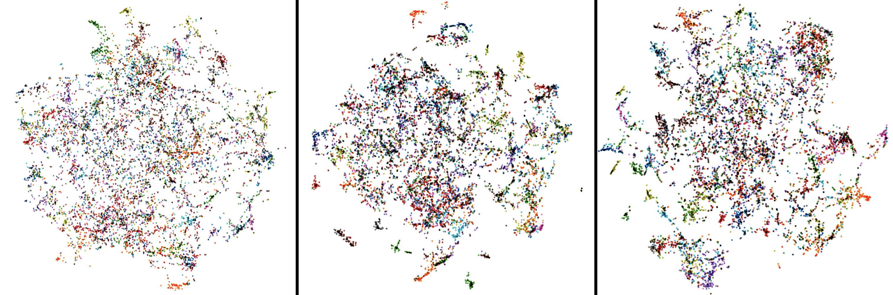

### Implementation of Contrastive Learning Methods based on Memory Bank, SimCLR and BYOL
Run the Instance Discrimination (representative contrastive learning method) task by:
 
`python run.py --data './data/' --cudaenv '0,1,2,3' --gpus '0,1,2,3' --exp 'your_exp_path' --dataset cifar100 --batch_size 128 --lr 0.03 --network resnet18_cifar --t 0.30 --loss insd`

Run the BYOL by the following command:
 
`python byol.py --data './data/' --cudaenv '0,1,2,3' --gpus '0,1,2,3' --exp 'your_exp_path' --dataset cifar100 --batch_size 512 --lr 0.12 --network resnet18_cifar`

### CIFAR100 Results (with ResNet-18 as Default Backbone)
For Instance Discrimination task, the results on CIFAR100 with different temperatures (weight decay of 5e-4, linear projection head) are:

--------

Temporature  | 0.05 | 0.07 | 0.10|0.20|0.30|0.40|0.50|0.60|0.70|0.80|
--------- | --------| --- | --- | --- | --- | --- | --- | --- | --- | --- |
LinearAcc |49.80|51.82|52.46|56.05|**56.44**|55.47|54.17|53.05|50.99|50.08|

-------
the best temperature is 0.3. When replacing a mlp projection head (with batch normalization), the accuracy is 56.48 (batch size of 512 lr 0.12), giving neglectable improvement on small scale dataset.

For BYOL, I have only tested a simple set of hyper-parameters: using a fixed momentum of m=0.996 (instead of a cosine ramp up function in the original paper):

|Network|BYOL|BYOL(aug+)|SimCLR(t=0.5,aug+)|BestInsDis|
|----|----|----|----|----|
|Res18|59.96|62.74|60.78|56.44|
|Res50|64.64|65.51|--|62.74|

#### BYOL Loss Curve
-----------------------------

<!--  -->
Loss Curve on ResNet-18 BYOL (left) and ResNet-50 BYOL (right)

-----------------------------

#### Embedding Visualization

##### ResNet18 FC Comparison.
The T-SNE visualization of features from **FC** layer with **ResNet-18** as backbone, instance discrimination (left, t=0.20), BYOL (middle, no blur), BYOL_aug+ (right, with blur).

----------------------

----------------------

##### ResNet18 CONV Comparison
The T-SNE visualization of features from **the last CONV** layer with **ResNet-18** as backbone, instance discrimination (left, t=0.20), BYOL (middle left, no blur), BYOL_aug+ (middle right, with blur), SimCLR (right, aut+, t=0.50).

---------------------

### Ablation
#### Effect of BatchNormalization

BYOL is hightly dependent on the batch normalization, we examine it with the following settings: 

1. take out the BN in MLP head projection.
2. take out the BN in Backbone architechutre.
3. take out the BN in predictor.

**Default Setting**: Except for the above three variants, all other settings are identical: with BYOL aug+, ResNet-18. The default t-SNE is calculated on the output of the last convolutional layer.

|Setting|Results|
|----|----|
|Baseline|62.74|
|MLP projection without BN|50.67|

Comparison of with or without MLPBN, using the above **Default Setting**, we visulaize the t-SNE, with MLPBN (left), without MLPBN(right).

----------------------

----------------------

### CIFAR10 Results

For Instance Discrimination task, the results on CIFAR10 with different temperatures (weight decay of 5e-4, linear projection head) are:

--------

Temporature  | 0.05 | 0.07 | 0.10|0.20|0.30|0.40|0.50|0.60|0.70|0.80|
--------- | --------| --- | --- | --- | --- | --- | --- | --- | --- | --- |
LinearAcc |76.10|79.75|81.82|**83.78**|83.27|83.22|82.54|82.97|82.69|82.67|81.97|82.21|

-------

the best temperature is 0.2.

For BYOL, I have only tested a simple set of hyper-parameters: using a fixed momentum of m=0.996 (instead of a cosine ramp up function in the original paper):

|Network|BYOL|BYOL(aug+)|BestInsDis|
|----|----|----|----|
|Res18|-|89.06|83.78|

#### Embedding Visualization

The T-SNE visualization of features from **the last CONV** layer with **ResNet-18** as backbone, instance discrimination (left, t=0.20), BYOL_aug+ (right, with blur), dataset: CIFAR10.

----------------------

----------------------

